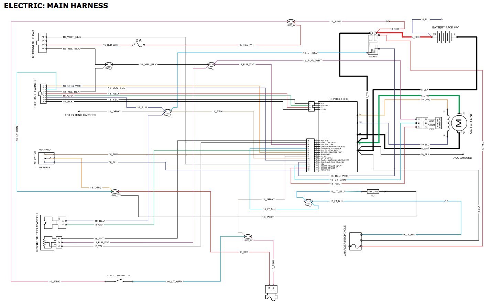
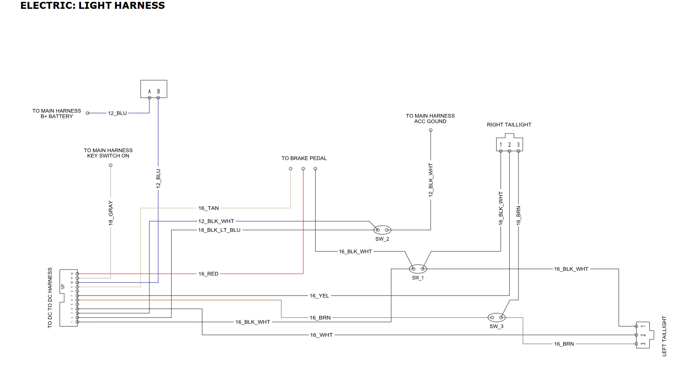
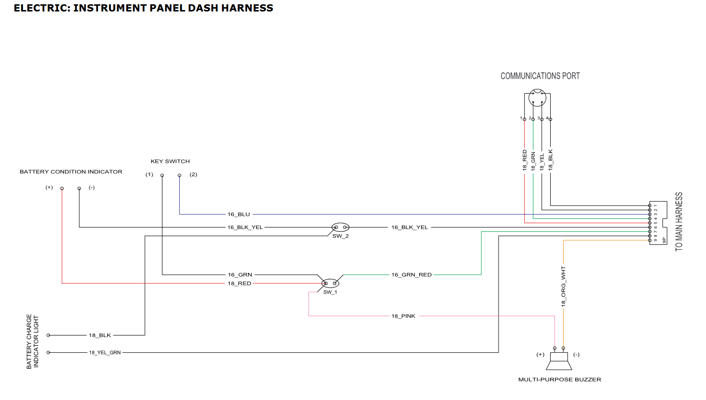
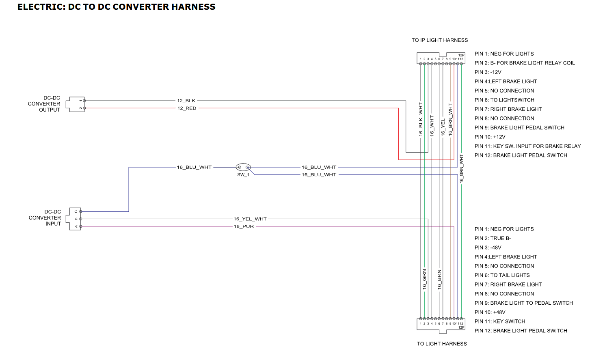
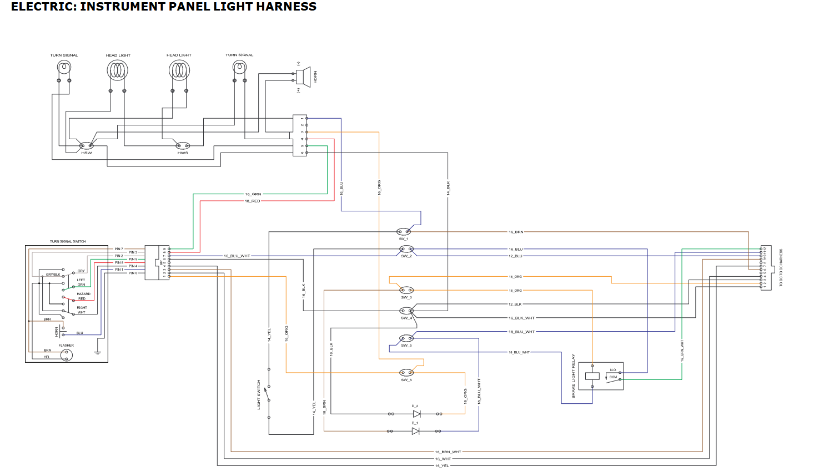

#  Detailed Design: Power Management System 

# Introduction

## Purpose
This document outlines the detailed design specifications for the Power Management subsystem for a universal solar-powered golf car retrofit that was developed in collaboration with 
LaniEV. This subsystem provides the power transfer required for charging of the solar panel and all electrical components that this entails.

## Outline

- Function of the Subsystem
- Specifications and Constraints
- Overview of Proposed Solution
- Interface with Other Subsystems
- Buildable Schematic
- Operational Flowchart
- Bill of Materials
- Analysis
- References

# Function of the Subsystem

The Power Management subsystem serves as the electrical interface between the battery and solar panel subsystems in the solar conversion kit. It also includes the pre-existing 
electrical wiring from the original golf car architecture.

## Primary Functions

- Transfer power safely from the solar panel to the LiFePO4 battery
    - Accept power from 400W+ solar panel
    - Route power through MPPT controller to control maximum power output
    - Deliver power generated from the solar panel to the battery for charging

- Ensure all existing electrical systems in the golf car are functional: blinkers, headlights, taillights, indicators, etc.

- Protect the battery and charging unit from unsafe conditions: weather, power surges, etc.

## Compatibility

The subsystem is designed for universal compatibility with the following golf car manufacturers: 

- Club Car

- Yamaha

- E-Z-GO

Club Car is the baseline for testing and experimentation during the developmental process of the retrofit kit.

# Specifications and Constraints

## Specifications

### Battery

- The subsystem shall provide charging compatibility with the LiFePO4 battery, while maintaining compatibility with existing golf car electrical architecture
- The subsystem shall maintain charging voltage and current within the batteries allowable limits
- The subsystem shall interface with the battery without interfering with motor control

### Solar Input

- The subsystem shall accept the expected power from the solar panel
- The subsystem shall function under variable input solar conditions

### Energy Conversion

- The subsystem shall regulate solar input into controlled battery power charging
- The subsystem shall use MPPT based charging power optimization

## Constraints

### Existing Architecture

- The power management system must work with the existing electrical wiring in the golf car
- There is limited space and support for the installation of the new battery and charger

### Solar Power

- Power generated
    - The solar panel will generate power, but under varying conditions this power may be generated inefficiently

- Limited space:
    - There is limit to the size of solar panel that can be installed on the golf car without compromising its structural integrity

- Variable conditions
    - Weather, temperature, and sunlight conditions will all change and affect the amount of power being generated by the solar panel

### Battery Change

The original golf car had:
- 6 batteries rated at 8V each = 48V
- Each battery has a positive and negative terminal, allowing for more connections

The new battery is:
- 51.2V
- There is only one battery to make all necessary connections, so there is significantly less space

### Battery Space

The new battery also presents a challenge in how large it is

 - The new battery and charger will not both be able to fit inside the housing underneath the seat. Another location for the charger to mount needs to be found.

There is also not enough support in the housing for the new battery to be placed, since it weighs roughly 103 lbs

### Ethics

The subsystem design and analysis must support honest communication of system performance and may not overstate the role of solar charging in total vehicle propulsion. If solar power 
is only a secondary factor in charging the battery, this must be communicated clearly.

# Overview of Proposed Solution

### Existing Architecture

The solar panel will be implemented to the existing structure of the golf car, ensuring all connections necessary for its function will be made safely. An MPPT charge controller 
(more info in the next section) will be installed on the existing architecture.

### Solar Input

The power generated by the solar panel will go through an MPPT controller to regulate the electrical operating point of the panel so that it operates at its maximum power point under 
the conditions it is in. The output regulated charging voltage/current will be delivered to the battery through wiring.

The wiring needed to connect the solar panel to the battery will travel through the mounts on the back of the golf car. This process is detailed in the Structural Frame Design 
subsystem of the project. A fuse will also be connected to this for safety.

A potential change that would help overcome the variability of the solar panels input would stem from a change in the Solar Energy subsystem. Rather than having a think fabric 
covering the underside of the solar panel, since the solar panel is dual-sided, a glass frame can be implemented. This would allow for solar energy reflecting from the ground to also 
contribute to the power being generated by the solar panel, further increasing its efficiency.

### Battery Space

A large white plastic housing will be shaped and implemented into the electrical bay of the golf car, underneath the passenger seating. This will provide extra stability and support 
for the battery.

The charge controller for the battery will be implemented on the outside of this plastic container, on the back of the vehicle. It will be implemented so that it fits next to the 
motor and motor controller.

A fuse will also need to be implemented to the output of the battery to help protect the electrical system of the golf car.

# Interface with Other Subsystems

Provided is a list of information regarding what the Power Management subsystem takes as input, what the subsystem outputs to other subsystems, data being transferred between 
subsystems, and the methods of communication for each subsystem that the Power Management subsystem interacts with.

## Solar Panel Subsystem

**Input**

- Variable DC current and voltage from the solar panel
- Solar power generated under varying weather conditions

**Output**

- Required photovoltaic (PV) operating range for controller compatibility
- Display information regarding remaining charge percentage of the battery via a display attachment on the solar panel

**Transferred Data**

- Panel rated power

**Means of Communication**

- PV+ and PV- wires between the MPPT controller and the solar panel

## Battery Subsystem

**Input**

- Power delivered to the battery, originating from the solar panel
- Battery charging limits/requirements
- Battery chemistry

**Output**

- Information regarding the battery's remaining charge will be output from the battery and displayed on the solar panel via a display attachment

**Transferred Data**

- Battery ratings and information: 51.2V, 105Ah
- Maximum charging current allowed
- Remaining charge left in the battery

**Means of Communication**

- Electrical wiring connecting to and from the battery terminals

## Structural Frame Subsystem

**Input**

- Fuses across existing electrical wiring to protect its electrical systems from power surges
- Mounting for the charge controller

**Output**

- Necessary pathing for the wiring inside the structure of the golf car, allowing for secure and safe electrical connections
- Physical protection from weather and vibrations

# Buildable Schematic 

Attached are schematics of the internal wiring of the vehicle from the golf cars service manual. A buildable circuit schematic on a software yet to be chosen, as per this sections 
requirements, is in the works and will be done by the beginning of the Fall 2026 Semester.
Note: The solar panel still needs to be integrated into these schematics 

<figure>
  
  <figcaption><strong>Figure 1.</strong> Main Harness</figcaption>
</figure>

<figure>
  
  <figcaption><strong>Figure 2.</strong> Light Harness</figcaption>
</figure>

<figure>
  
  <figcaption><strong>Figure 3.</strong> Instrument Panel Dash Harness</figcaption>
</figure>

<figure>
  
  <figcaption><strong>Figure 4.</strong> DC-DC Converter Harness</figcaption>
</figure>

<figure>
  
  <figcaption><strong>Figure 5.</strong> Instrument Panel Light Harness</figcaption>
</figure>

# Operational Flowchart

# Bill of Materials

Note: More materials are necessary than what is currently listed. This list will also be improved upon over the summer.

- White heavy duty plastic containers for added structural integrity - $TBD
- MC4 solar extension cable pair, 10 AWG, 10–20 ft - $20-$40
- 12 AWG ring terminal lead pair - $10-$20

# Analysis

### Power Input and Charging

The amount of power going into the battery from the solar panel would not usually be enough to fully support a motor vehicle under normal every day uses. However, since these golf 
cars in particular are not being used hours on end, and are likely only being used to travel small distances in relatively friendly terrain, not caring terribly heavy loads, the 
power provided by the solar panel should be enough to keep the golf car functioning on reasonable charging levels throughout a day, even if charging conditions are not perfect.

Due to these relatively friendly conditions and low use-time, the charging that the solar panel provides in this design will be enough to run the golf car almost completely 
unassisted on a daily basis, with charging via other means only being necessary when abnormal driving scenarios or conditions are present.

### Battery and Controller Space

The solution to the limited space and stability that the existing golf car provides for the battery is to implement a heavy duty plastic container into the electrical bay underneath
the golf car's seats. If properly outfitted, these containers will have all of the necessary entrance and exit points for the wiring to connect to the battery while providing a 
stable surface for the battery to protect it from vibrations while the golf car is in use. This also solves the issue of not having enough space for the charge controller as well, 
because it provides an outlet on the outside of the container to put fasten the charge controller to, so that it is not only safe but close in proximity to the battery as well.

### 

# References

[1] Club Car 2019 Precedent Golf Car Maintenance and Service Manual: https://www.dropbox.com/s/bqgrvbcd8hvqzzt/2019%20Precedent%2C%20%28ERIC%20And%20ECH440%29%20Electric%20And%20Gasoline%20Maintenance%20And%20Service%20Manual.pdf?dl=1

[2] Cables connecting solar panel to MPPT Controller https://powerwerx.com/mc4-solar-extension-cable-pair?gad_source=1&gad_campaignid=409396682&gclid=CjwKCAjwqazPBhALEiwAOuXqdCWDkNmysP9kKtedcCGbJN1e8AB-apHamwST0BTtPz1JgbIhj_7MeBoC28QQAvD_BwE

[3] Ring terminals connecting solar panel to battery https://www.newpowa.com/3-ft-12-awg-cable-w/-ring-terminals-fuse-protection/

